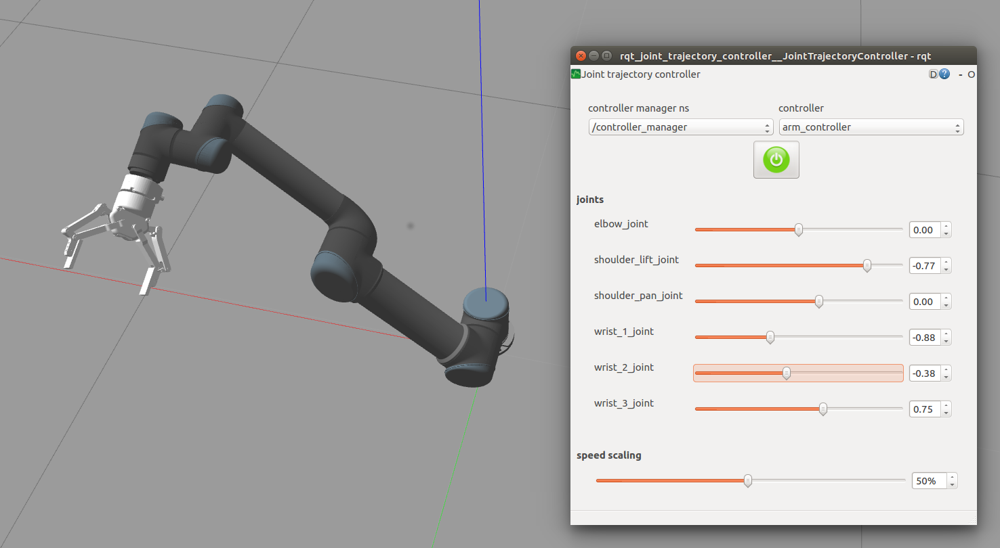

# ur5_with_robotiq_gripper
Author: Yuxiang Gao and Yeping Wang

---
__ROS Version__ : Kinetic

__Dependence__

[universal_robot](https://github.com/ros-industrial/universal_robot) : URDFs and Meshes for UR5

[ur_modern_driver](https://github.com/ros-industrial/ur_modern_driver) : Drivers for UR5.

[robotiq](https://github.com/ros-industrial/robotiq) : Drivers for the Robotiq gripper.

[roboticsgroup_gazebo_plugins](https://github.com/roboticsgroup/roboticsgroup_gazebo_plugins) : For the gripper simulation in Gazebo

[ros_controllers]: For the CripperActionController. Can be installed with `sudo apt-get install ros-kinetic-ros-controllers`

---

__Usage with Gazebo simulation__



To start the Gazebo simulated ur5 and the gripper:

```roslaunch icl_ur5_setup_gazebo icl_ur5_gripper.launch```

Then bring up the moveit:

```roslaunch icl_ur5_setup_moveit_config ur5_gripper_moveit_planning_execution.launch sim:=true```

Finally, run a Rviz to visualize the trajectory:

```roslaunch icl_ur5_setup_moveit_config moveit_rviz.launch config:=true```

To bringup the slide bar for each joint:
```
rosrun rqt_joint_trajectory_controller rqt_joint_trajectory_controller
```

---

__Usage with the hardware__

This package communicates with Robotiq 140 gripper using the [robotiq_action_server](https://github.com/ros-industrial/robotiq/tree/kinetic-devel/robotiq_2f_gripper_action_server) through Modbus RTU protocol, so the first step to do is to connect the gripper using USB.

To bring up the whole arm configuration with all drivers, you can use the following command:

```roslaunch icl_ur5_setup_bringup ur5_gripper.launch```

If there are some connection error, you may need to change the `robot_ip` and `gripper_port` in the launch file. To find the robot ip address:

UR’s teach-pendant -> Setup Robot -> Setup Network Menu -> ip address

Activited the gripper:

```roslaunch icl_ur5_setup_bringup activate_gripper.launch```

Then press 'r' to reset and press 'a' to activite the gripper.

Bring up the moveit:

```roslaunch icl_ur5_setup_moveit_config ur5_gripper_moveit_planning_execution.launch```

Finally, run a Rviz to visualize the trajectory:

```roslaunch icl_ur5_setup_moveit_config moveit_rviz.launch config:=true```

---

__To control the gripper__

Publish the position value to `icl_gripper/gripper_cmd/goal` (or the topic under a similar name). 

position value 0.0: open

position value 0.8: close

__Reference__

This repo learns a lot from [icl_phri_ur5](https://github.com/intuitivecomputing/icl_phri_ur5), [UR5-with-Robotiq-Gripper-and-Kinect](https://github.com/philwall3/UR5-with-Robotiq-Gripper-and-Kinect) and [tams_ur5_setup](https://github.com/TAMS-Group/tams_ur5_setup)
